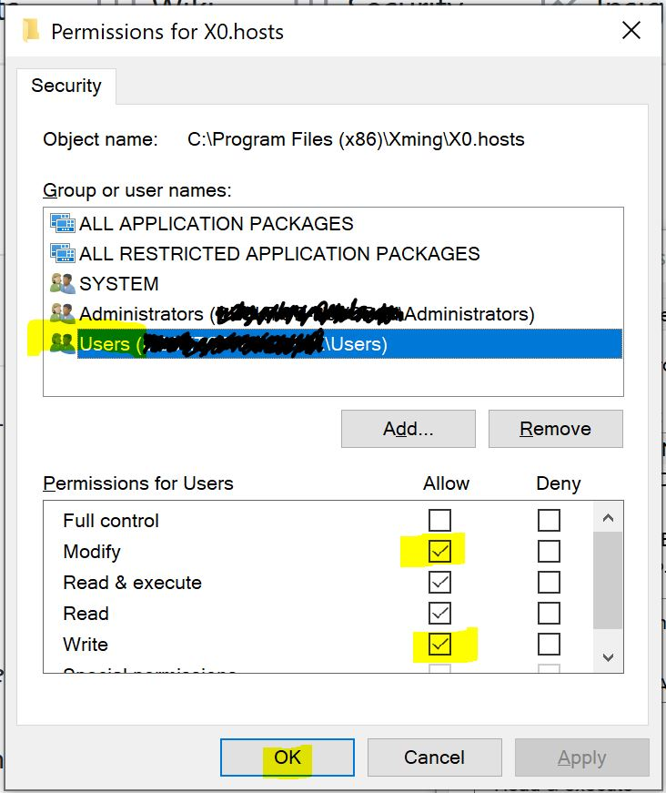

# WSL2 Debian Buster x11 apps on win10 using Xming

## Motivation  
To install a [x toolbar launcher](https://github.com/cascadium/wsl-windows-toolbar-launcher),  
using [Xming](https://sourceforge.net/projects/xming/files/),  
and being able to run X11 apps.  

## Required
- A functional Windows Linux Subsystem v2 (WSL2) Debian distro on windows 10  
- X11 apps (at least do `apt install xeyes` or `xterm`)  
- Xming, _installing the fonts too is highly suggested_  
- Admin permissions for both win10 and wsl user  

## What the script does 
1. Sets the Xming x0.hosts ip by reading the WSL2 reported ip, i.e., `$ ip a show eth0`  
2. Sets the display env variable in WSL2 by reading the win10 reported WSL2 ip, i.e., `(ps) ipconfig`  
An alternative would be to add `export DISPLAY=$(grep -m 1 nameserver /etc/resolv.conf | awk '{print $2}'):0` to your `.bashrc`, because the nameserver is the external ip seen by windows 10...?
3. Runs Xming

## Instructions before using the script  

Unlike WSL1 the IP address for the WSL2 local network is not static. 

Xming needs the WSL2 IP address so this script sets it in the `X0.hosts` file, which is assumed to be here:

    C:\\Program Files (x86)\\Xming\\X0.hosts

1. Since this is a protected folder *you should enable user edition of this file to run the script normally using powershell*.

> Open File Explorer > Goto C:\\Program Files (x86)\\Xming > 2nd button on X0.hosts > Properties > Security > Edit (will ask for admin privileges) > Select Users > Select Modify and Write permissions > Click Ok.

    

In addition the script sets the Windows adapter IP address in WSL2 Linux, in a file called:

    ~/.wslrc

2. Make sure that file is editable, creating it and enabling permissions before hand:

    $ touch ~/.wslrc  
    $ chmod a+rwx ~/.wslrc

When in WSL2, you must get this to update the `DISPLAY` env variable it sets by executing:

    source ~/.wslrc
    
You can achieve this on every shell session by adding that line to the head of your `.bashrc` -recommended before the `# If not running interactively, don't do anything` part. 

3. Open powershell, run  
    `PS C:\...\...> .\xming-start-for-wsl2.ps1`  
    
## Localhost disclaimer  
When Xming is working, jupyter-lab copy-and-pasting to open in a local windows browser explorer doesn't work. So you might want to activate it yourself instead of putting it on your `.bashrc`.
